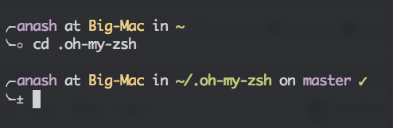

# apeware.zsh-theme
Combines the best of Bira and [Steve Losh's extravagant theme](https://stevelosh.com/blog/2010/02/my-extravagant-zsh-prompt/)



### Installation Instructions for ApeWare Zsh Theme

#### Prerequisites
- You need [Oh My Zsh](https://ohmyz.sh/) installed, as this theme is designed for use with it. If you don't have Oh My Zsh, install it first with this command:

  ```bash
  sh -c "$(curl -fsSL https://raw.githubusercontent.com/ohmyzsh/ohmyzsh/master/tools/install.sh)"
  ```

#### Installation via Terminal
1. Download the theme file to your custom themes directory (this will create the directory if it doesn't exist):

   ```bash
   curl -fLo ~/.oh-my-zsh/custom/themes/apeware.zsh-theme --create-dirs \
       https://raw.githubusercontent.com/ApeWare/apeware.zsh-theme/master/apeware.zsh-theme
   ```

2. Edit your `~/.zshrc` file to set the theme (you can use `nano`, `vim`, or any editor):

   ```bash
   sed -i '' 's/ZSH_THEME=".*"/ZSH_THEME="apeware"/' ~/.zshrc
   ```

   Alternatively, open `~/.zshrc` manually and change the `ZSH_THEME` line to:
   
   ```
   ZSH_THEME="apeware"
   ```

3. Reload your Zsh configuration to apply the changes:

   ```bash
   source ~/.zshrc
   ```

If you encounter any issues, ensure the theme file is correctly placed in `~/.oh-my-zsh/custom/themes/` and that Oh My Zsh is properly configured.
